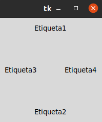
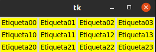
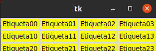
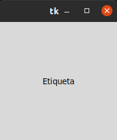

# 1. POSICIONAMIENTO Y DISEÑO 

## Gestor de geometría distribuye loswidgets en horizontal o en vertical 

## Gestor de gometría Grid 

### Con grid la distribucion de los widgets se realiza de una maner mas flexible, utilizando un diseño de cuadrícula. De esta manera. cada widgets en la celda determinada por la intersección de una fila y una columna. 

## Gestor de gometría place

### Este gestor permite colocar los widgets en cooodenadas especificas de la ventana principal o del widgets contenedor.

