# LLAMADA WEDGETS

## Gestor de button 

### Esta compuesto por dos buttones donde el primero es para iniciar eltemporizador y el segundote permite parar.

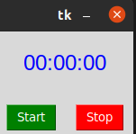

## Gestor entry

### En el podras dar o ingresar tus datos, lo que viene siendo el usuario y la contraseña.

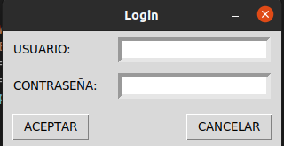

## Gestor Reloj

### programa donde muestra la hora excata.

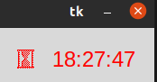

## Gestor listbox

### Gracias a este programa podras traducir "Hola" en ingles,italiano, aleman y frances. Asi podras saber como se dice en cada pais.

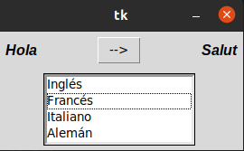

## Gestor menu

### En esta ventana podras crear un nuevo archivo y guardalo, la ventana tiene una bandeja de entrada al lado superior izquierdo se encuentra "Archivo" ahi puedes buscar tu archivo o crear uno nuevo, en el medio estála "Edicion" en el podras eliminar, copiar y pegar cualquier cosa. Al lado superior derecho se encuentra "Ayuda"te permitira ayudarte con problemas que se  presente ala hora de mirar tu archivo.

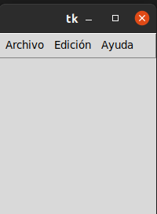

# Gestor de Menubutton

## te encontraras con un formulario donde tienes que ingresar tu datos basicos que quiere decir ésto; tendras que llenarlo con tu nombre, dirreccion donde vives, la edad y el sexo.

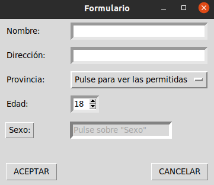

# Gestor de messagebox

## Tendras la oportunidad para decidir si aceptar o cancelar el formulario.

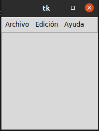

# Gestor de optionmenu

## donde master es la ventana de alto nivel que la contiene. Los menús que aparecerán en la barra de menús se han de crear con la mismo orden, esta vez indicando que su master es el identificador usado para la barra de menús.

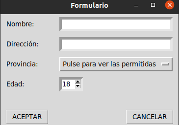

# Gestor de scale_arco

## Permite seleccionar un rango de números deslizando el control deslizante. Puede controlar el máximo, el mínimo y la resolución del componente. En este caso es un angulo.

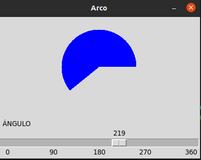

# Gestor scroll

## se usa normalmente para desplazar widgets como ListBox , Text o Canvas verticalmente, o Entry horizontalmente. Muestra un deslizador en la posición correcta.

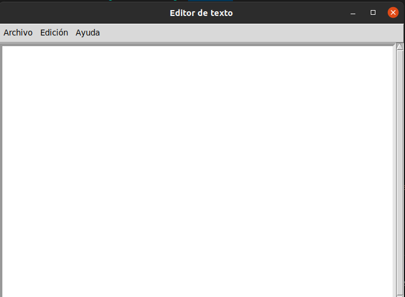

# Gestor spinbox

## En el tendras una opcion donde puedes colocar tu edad y si llegas a ponerla mal puedes cambiarla sin ternerla que escribir.

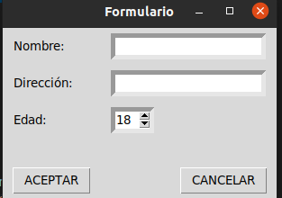

# Gestor text

## sirve para guardar archivo o tambien para copiar ypegar cosas.

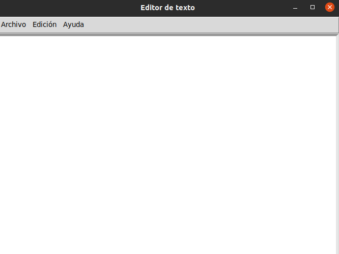

# Gestor toplevel

## en esta interfax podras aaceder ala cuenta que ingresaste con tus datos y si no agregaste nada el te lo dira para que puedas formularlo otra vez.

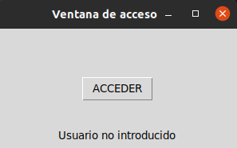